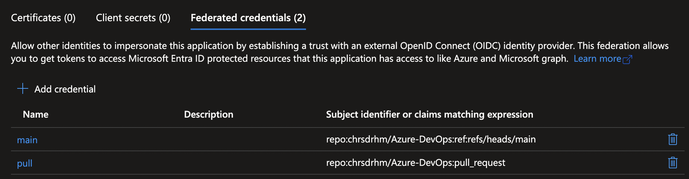

# Azure-DevOps
Working example repo for GitHub Actions to manage Intune, Entra, and Azure resources via Azure CLI, Azure PowerShell, Microsoft Graph, and Terraform.  This was a learning tool for myself as I explored CI/CD primarily for Microsoft Intune.

In this example, 2 GitHub Actions workflows are used:
- scripts.yml, working with Microsoft Graph and Azure via PowerShell and Azure CLI
- terraform.yml, working with Microsoft Graph (Intune / Entra) and Azure via Terraform

The following events will trigger these workflows to execute:
- terraform.yml runs only when a pull request is opened for updates to the .\terraform directory, indicating there may be new resources to plan and deploy
- scripts.yml runs daily, regardless of pull requests ... for example, these scripts may be used to automate processes, etc.
- Manual execution (workflow dispatch)

In practice, I think a feature branch, dev branch, main branch approach would be best.  i.e., create a feature branch, open a pull request to dev branch, review tf plan output, merge to dev to execute tf apply, if everything applies as expected, then open a pull request to merge dev into main and execute tf apply on merge.  While this example doesn't account for a dev branch, this would address situtations where a successful tf plan fails to apply after merging to main.

## Setup local environment
- Install required resources
    - az cli
    - Microsoft.Graph.Authentication PowerShell module
    - Terraform
    - VSCode extensions
        - PowerShell
        - Terraform
        - GitHub
        - GitHub Actions
- Set Terraform environment variables ... Azure subscription ID, naming prefix, region
    - Configure via tfvars (preferred)
    - Pwsh ... $env:TF_VAR_AZURE_SUBSCRIPTION_ID = "your-subscription-id"
    - Bash/zsh ... export TF_VAR_AZURE_SUBSCRIPTION_ID="your-subscription-id"

## Deploying backend
Terraform state for your GitHub Actions workflows will be stored in the 'backend', an Azure blob storage container.

The backend must be manually created / bootstrapped before running Terraform out of GitHub Actions ... this can be done with terraform as I've done in my example:
1) change directory to terraform-backend
2) az login
3) terraform init
4) terraform fmt -check
5) terraform fmt validate
6) terraform plan -out tfplan
7) terraform apply tfplan

## Setup Azure (Entra federation)
To allow your GitHub Actions workflow to authenticate to Azure / Entra, we must create an Entra service principal with any required permissions.  To avoid secrets management,  Workload Identity Federation is a good option; this uses a typical Entra service principal (app registration), but instead of creating a client secret, we will configure a Workload Identity, allowing federated access from your GitHub repo to Entra:

- Docs
    - https://learn.microsoft.com/en-us/entra/workload-id/workload-identity-federation-create-trust?pivots=identity-wif-apps-methods-azp#configure-a-federated-identity-credential-on-an-app
    - https://docs.github.com/en/actions/security-for-github-actions/security-hardening-your-deployments/configuring-openid-connect-in-azure
    - https://github.com/Azure/login#readme
- High-level setup
    - Create an Entra app registration
    - Grant any neccesary Graph API permissions
    - Grant 'Contributor' role to your app registration on Azure subscription where resources will be deployed
    - Create Federated credentials for main branch and pull requests
    

## Setup GitHub
Configure the following veriables using GitHub actions secrets / variables ... in my case I chose to configure these as 'Repository secrets':
- AZURE_TENANT_ID
    - Your Azure / Entra tenant ID
- AZURE_CLIENT_ID
    - The client ID of the app registration you created with Workload Identity Federation
- AZURE_SUBSCRIPTION_ID
    - Your Azure Subscription ID where resources will be deployed and where your app registration has been assigned the 'Contributor' role
- AZURE_TFBACKEND_RG
    - Resource group name where your backend tfstate storage account has been deployed
- AZURE_TFBACKEND_SA
    - Storage account name where your backend tfstate is stored
- AZURE_TFBACKEND_BLOB
    - Blob container name where your backend tfstate is stored within your storate account
- AZURE_REGION
    - Azure region for your resources (e.g. 'East US') ... alternatively you may configure this in your Terraform (variables.tf, locals.tf, tfvars, etc)
- NAMING_PREFIX
    - A naming prefix that will be used for resource names ... alternatively you may configure this in your Terraform (variables.tf, locals.tf, tfvars, etc)

## Work locally with remote tfstate
Sometimes, such as for development / testing, you want to run Terraform locally rather than from GitHub Actions, but still use your 'backend' tfstate:
1) az login
2) terraform init \  
    -backend-config="resource_group_name=<backendResourceGroupName>" \
    -backend-config="storage_account_name=<backendStorageAccountName>" \
    -backend-config="container_name=<backendBlobContainerName>"
3) terraform fmt -check
4) terraform fmt validate
5) terraform plan -out tfplan
6) terraform apply tfplan

## Attribution
This project may use or reference open source code, documentation, or examples from:
- [Microsoft Azure documentation and samples](https://learn.microsoft.com/azure/)
- [Microsoft Graph documentation and samples](https://learn.microsoft.com/graph/)
- [GitHub Actions documentation and samples](https://docs.github.com/actions)
- [HashiCorp Terraform documentation and modules](https://registry.terraform.io/)
- [HashiCorp AzureAD provider](https://registry.terraform.io/providers/hashicorp/azuread/latest)
- [HashiCorp AzureRM provider](https://registry.terraform.io/providers/hashicorp/azurerm/latest)
- [TerraProvider microsoft365wp](https://github.com/terraprovider/terraform-provider-microsoft365wp) (Business Source License)
